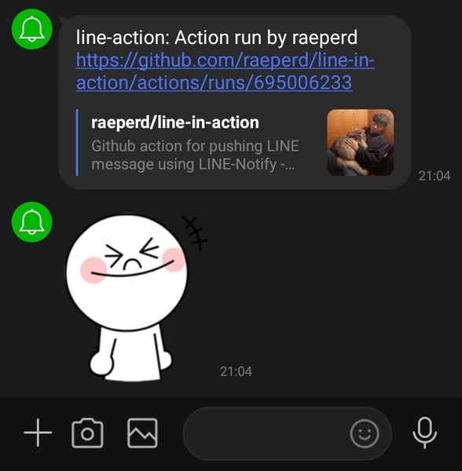

# LINE-in-action

[](https://github.com/raeperd/line-in-action/actions/workflows/test.yml)
[](https://sonarcloud.io/dashboard?id=raeperd_line-in-action)
[](https://sonarcloud.io/dashboard?id=raeperd_line-in-action)
[](https://sonarcloud.io/dashboard?id=raeperd_line-in-action)
[](https://sonarcloud.io/dashboard?id=raeperd_line-in-action)  
[](https://sonarcloud.io/dashboard?id=raeperd_line-in-action)
[](https://sonarcloud.io/dashboard?id=raeperd_line-in-action)

Github action for pushing LINE message using [LINE-Notify API](https://notify-bot.line.me/en/)

# Quick Preview

## On your github action yml files,

```yaml
runs-on: ubuntu-latest
    steps:
      - uses: actions/checkout@v2
      - uses: raeperd/line-in-action@v1.0
        with:
          token: ${{ secrets.LINE_NOTIFY_TOKEN }}
          message: Action run by ${{ github.actor }}
          notificationDisabled: false # optional
          stickerPackageId: 1         # optional
          stickerId: 2                # optional
```



- For GitHub environment variables avaliable in [GitHub Docs](https://docs.github.com/en/actions/reference/environment-variables#default-environment-variables)
- For Sticker available on LINE checkout [Stickers](https://developers.line.biz/media/messaging-api/sticker_list.pdf)
  - But this documentation is not valid for now, I found only stickerPackageId = 1, and stickerId = 1..15 is valid

# Getting started

## What you needs

1. LINE Notify Token
2. A little knowledge about Github action

## Generate LINE Notify Tokens

Go to [LINE Notfiy Web Page](https://notify-bot.line.me/my/) then you can get token by login LINE ID & passwords.  
For more detailed descriptions, [Offical LINE Notify Documents](https://notify-bot.line.me/doc/en/) might be helpful

And you "must" pass your TOKEN to action bia repository secret.
For more detail, Check [Github action secret](https://docs.github.com/en/actions/reference/encrypted-secrets) out

# Features

1. Send Notifty message
2. Append action url to message so that you can quickly navigate to action page
3. Simple stupid Code as you expect with resonalbe amount of tests

# LISENCE

The MIT License (MIT)

# REFERENCE

- [GitHub Docs - Createing a JavaScript action](https://docs.github.com/en/actions/creating-actions/creating-a-javascript-action)
- [LINE Notify API Document](https://notify-bot.line.me/doc/en/)
- [actions/typescript-action](https://github.com/actions/typescript-action)
